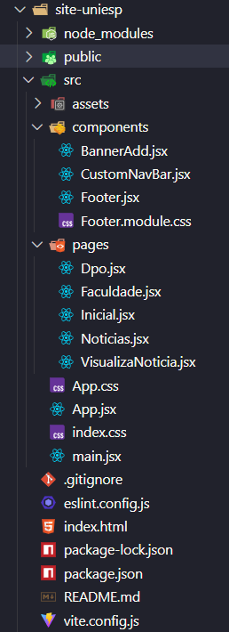

# Projeto UNIESP — Mini Site Institucional (React.js)

Este projeto é um site institucional desenvolvido em React.js, com páginas internas, navegação via React Router e componentes reutilizáveis como Navbar e Footer.

### O objetivo do projeto é servir como base para um site moderno, responsivo e bem estruturado, usando boas práticas de organização, rotas e componentes.

## 🚀 Tecnologias Utilizadas

React.js
React Router DOM
React-Bootstrap
CSS Modules (para componentes como o Footer)
CSS Global (App.css) — layout e responsividade do app
JavaScript (ES6+)

## 📂 Estrutura do Projeto


## 🧭 Rotas da Aplicação

O projeto utiliza React Router para controle de navegação.

/	Página Inicial
/a-faculdade	Informações sobre a instituição
/dpo-lgpd	Página sobre DPO & LGPD
/noticias	Seção de notícias da UNIESP

## ⚙️ Como Rodar o Projeto

### 1. Clone o repositório
```bash
git clone https://github.com/SamuelloranD/demo-springboot-jpa.git
```

### 2. Instale as dependências
npm install

### 3. Execute o servidor de desenvolvimento
npm start

O site ficará disponível em:

http://localhost:5173/

## 📌 Componentes Principais
#### 🔹 CustomNavbar
Navegação principal do site
Links para todas as páginas

### 🔹 Footer
Implementado com CSS Modules
Responsivo e fixado ao final da página
Informações institucionais + links úteis

### 🔹 Páginas:
Inicial — página de boas-vindas
Faculdade — informações da instituição
DPO & LGPD — políticas e dados
Notícias — atualizações e comunicados

## 📄 Licença
Este projeto é de uso acadêmico e institucional.
Utilize livremente para estudos e melhorias internas.